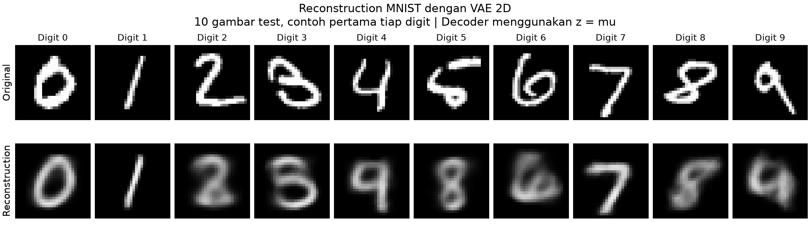
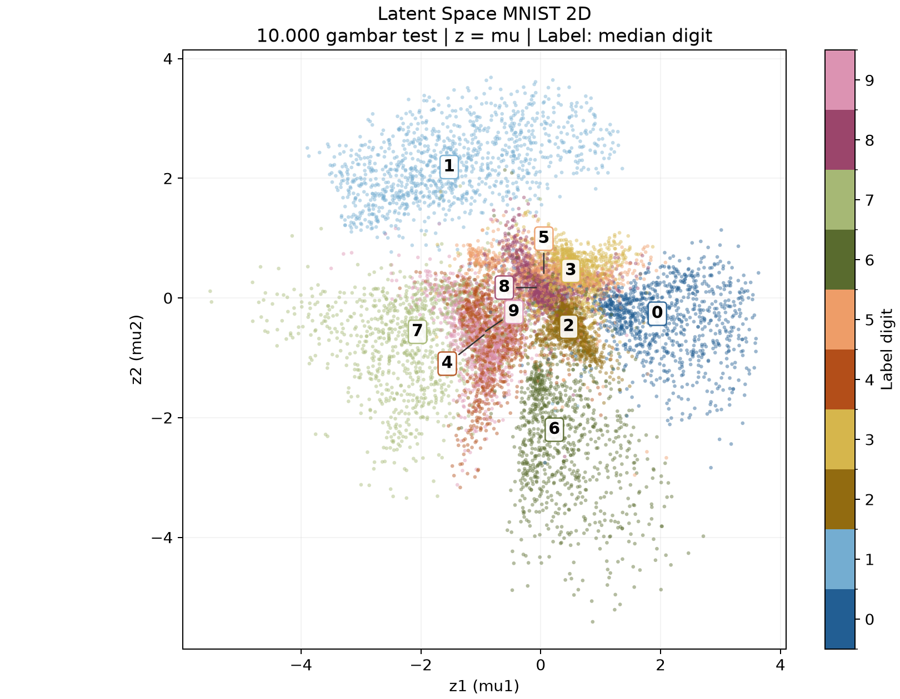
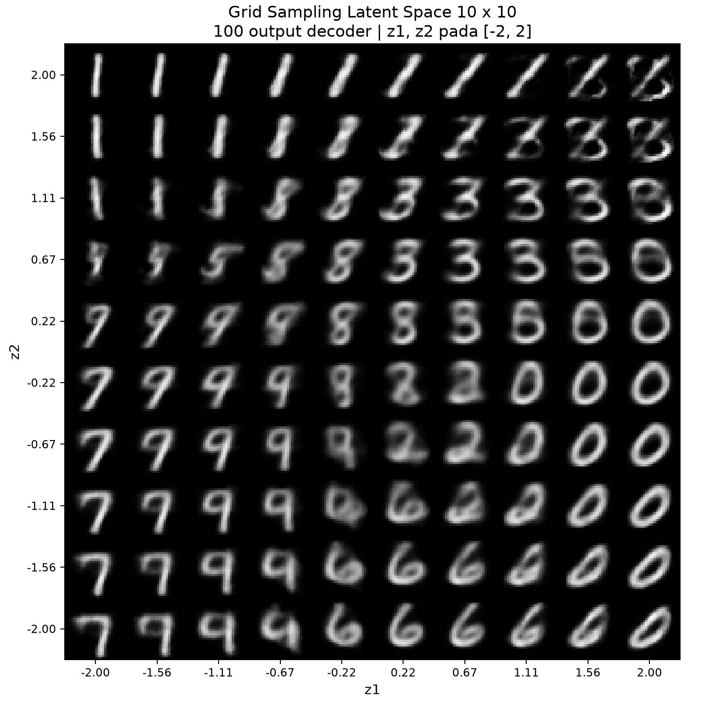
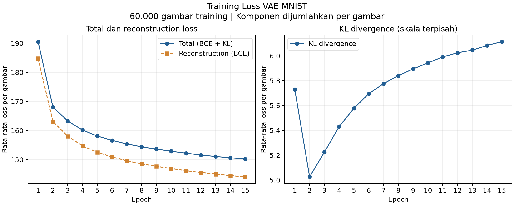

# Variational Autoencoder MNIST dengan Latent Space 2D

Project tugas Generative AI ini menggunakan PyTorch untuk mempelajari representasi gambar tulisan tangan, merekonstruksi input, dan menghasilkan gambar baru melalui latent space dua dimensi. Implementasi utama tersedia di `vae_mnist.py`.

## Apa itu VAE?

Variational Autoencoder (VAE) adalah model generatif dengan encoder dan decoder. Encoder memetakan gambar ke parameter distribusi latent. Decoder menerima sampel dari distribusi tersebut untuk menghasilkan kembali gambar. Dengan demikian, satu input diwakili oleh distribusi, bukan hanya satu titik tetap.

Dalam project ini, prior latent adalah distribusi normal standar `N(0, I)`. Setelah training, decoder juga dapat menerima koordinat baru tanpa gambar input. Dasar pendekatan ini dijelaskan oleh Kingma dan Welling dalam [Auto-Encoding Variational Bayes](https://arxiv.org/abs/1312.6114).

## Objective

1. Memetakan gambar MNIST ke latent space berukuran tepat 2.
2. Membandingkan gambar asli dengan hasil reconstruction.
3. Mengamati distribusi representasi test berdasarkan label digit 0 sampai 9.
4. Menghasilkan 100 gambar baru pada grid latent 10 x 10.

## Dataset dan preprocessing

MNIST berisi gambar grayscale tulisan tangan berukuran 28 x 28 piksel. Project memakai seluruh 60.000 gambar training dan 10.000 gambar test. Dataset dimuat dengan `torchvision.datasets.MNIST(..., download=True)`. Berkas yang sudah tersedia di `data/` dipakai kembali; jika belum tersedia, torchvision akan mengunduhnya. Perilaku ini mengikuti [dokumentasi MNIST torchvision](https://docs.pytorch.org/vision/stable/generated/torchvision.datasets.MNIST.html).

`transforms.ToTensor()` mengubah intensitas piksel dari rentang 0 sampai 255 menjadi float pada rentang 0 sampai 1, dengan bentuk `(1, 28, 28)`. Input tidak dinormalisasi ke nilai negatif karena target BCE harus berada di rentang 0 sampai 1. DataLoader mengacak data training setiap epoch, sedangkan urutan test tetap. `num_workers=0` dipakai agar sederhana dan mudah dijalankan pada Mac.

Label tidak dipakai untuk menghitung loss atau melatih model. Label hanya membantu memilih contoh reconstruction dan memberi warna pada scatter plot. Data test tidak masuk ke optimizer.

## Arsitektur model

```text
Input MNIST: (batch, 1, 28, 28)
                |
             Flatten
                |
       Linear(784, 400) + ReLU
                |
        +-------+-------+
        |               |
 Linear(400, 2)  Linear(400, 2)
       mu            log_var
        |               |
        +-------+-------+
                |
 z = mu + exp(0.5 * log_var) * epsilon
                |
      Latent vector: (z1, z2)
                |
        Linear(2, 400) + ReLU
                |
          Linear(400, 784)
                |
    Sigmoid untuk output gambar
                |
     Reshape: (batch, 1, 28, 28)
```

Model menggunakan satu hidden layer di encoder dan satu di decoder. Tidak ada convolution, classifier, atau komponen tambahan yang rumit. Struktur ini mengikuti pola MLP sederhana pada [contoh VAE resmi PyTorch](https://github.com/pytorch/examples/tree/main/vae), dengan latent dimension disesuaikan menjadi 2.

### Encoder, mu, dan log_var

Encoder merangkum 784 nilai piksel menjadi 400 fitur. Dua layer terpisah kemudian menghasilkan `mu` dan `log_var`, masing-masing dengan dua komponen.

- `mu` adalah mean distribusi posterior `q(z|x)` untuk gambar tertentu.
- `log_var` adalah logaritma varians, bukan logaritma standard deviation. Variansnya diperoleh dengan `exp(log_var)`.
- Posterior diasumsikan Gaussian diagonal. Artinya, model menyimpan varians tiap koordinat, tanpa mempelajari kovarians di antara keduanya.

### Reparameterization trick

Sampling ditulis sebagai:

```text
epsilon ~ N(0, I)
std = exp(0.5 * log_var)
z = mu + std * epsilon
```

Noise diambil melalui `torch.randn_like(std)`. Karena bagian acak dipisahkan dari `mu` dan `std`, backpropagation tetap bisa memperbarui parameter encoder. Saat training, `forward()` selalu menggunakan langkah sampling ini.

### Latent space 2D dan decoder

Latent vector hanya memiliki dua angka, `z1` dan `z2`. Kedua angka ini bersama-sama menyimpan informasi visual yang dipelajari model. Dimensi 2 memudahkan visualisasi, tetapi membatasi banyaknya detail yang dapat dipertahankan.

Decoder memetakan pasangan koordinat tersebut kembali menjadi 784 nilai. Saat training, decoder mengeluarkan raw logits untuk perhitungan BCE yang stabil. Fungsi `decode()` menerapkan sigmoid dan reshape sehingga hasilnya bisa ditampilkan sebagai gambar dengan nilai piksel antara 0 dan 1.

## Loss function

```text
Reconstruction = -sum_i [x_i * log(p_i) + (1 - x_i) * log(1 - p_i)]
KL = -0.5 * sum_j [1 + log_var_j - mu_j^2 - exp(log_var_j)]
Total loss = Reconstruction + KL
```

`i` menjumlahkan 784 piksel, sedangkan `j` menjumlahkan 2 dimensi latent. Masing-masing komponen kemudian dirata-rata terhadap jumlah gambar dalam batch. Bobot KL adalah 1, tanpa annealing.

Reconstruction loss mendorong output menyerupai input. Implementasinya menggunakan `binary_cross_entropy_with_logits`, yang menggabungkan sigmoid dan BCE secara numerik. Gambar MNIST tetap memakai intensitas float, tidak dibinarisasi. Karena itu, BCE di sini merupakan objective reconstruction yang umum digunakan untuk MNIST, bukan klaim bahwa setiap target grayscale adalah pengamatan Bernoulli biner.

KL divergence mengukur perbedaan posterior tiap gambar terhadap prior normal standar. Regularisasi ini membantu membentuk latent space yang dapat digunakan untuk sampling. KL tidak menjamin setiap kelas terpisah, ataupun seluruh titik latent menghasilkan digit yang sempurna.

Nilai yang dicetak per epoch adalah rata-rata loss per gambar, dengan kontribusi batch terakhir tetap ditimbang sesuai jumlah gambarnya. Nilai ini bukan accuracy, persentase error, atau rata-rata loss per piksel. Total loss merupakan estimasi negative ELBO dengan satu sampel latent per input.

## Konfigurasi training

| Parameter | Nilai default |
|---|---|
| Epoch | 15 |
| Batch size | 128 |
| Learning rate | 0.001 |
| Optimizer | Adam |
| Hidden dimension | 400 |
| Latent dimension | 2 |
| Bobot KL | 1 |
| Random seed | 42 |
| Urutan pemilihan device | CUDA, lalu MPS, lalu CPU |

Seed ditetapkan untuk Python, NumPy, PyTorch, dan shuffle DataLoader. Hasil antar-device atau versi library masih bisa sedikit berbeda. Seed evaluasi adalah seed training ditambah 1, sehingga evaluasi akhir tidak bergantung pada banyaknya random sampling selama training.

## Cara menjalankan project

Jalankan perintah berikut dari folder project:

```bash
source .venv-training/bin/activate
python vae_mnist.py
```

Environment yang dipakai untuk menjalankan tugas ini adalah `.venv-training`, menggunakan Python 3.12.14. Environment `.venv` lama tetap ada. Python sistem tidak diganti atau diturunkan versinya. `requirements.txt` mencatat versi empat dependency utama yang sama dengan environment awal.

Jika menyalin project ke komputer lain yang belum memiliki virtual environment:

```bash
python3 -m venv .venv-training
source .venv-training/bin/activate
python -m pip install -r requirements.txt
python vae_mnist.py
```

Menentukan konfigurasi secara eksplisit:

```bash
python vae_mnist.py --epochs 15 --batch-size 128 --lr 0.001 --device auto
```

Membuat ulang visualisasi dan evaluasi dari checkpoint yang tersimpan, tanpa training ulang:

```bash
python vae_mnist.py --evaluate-only
```

Gunakan `--device cpu`, `--device mps`, atau `--device cuda` untuk memilih device tertentu. Jika accelerator yang diminta tidak tersedia, script menampilkan pesan error yang jelas. Pilihan `auto` memakai CPU jika tidak ada accelerator yang terdeteksi. Backend matplotlib `Agg` menyimpan gambar langsung ke PNG tanpa memerlukan jendela grafik.

Training ulang akan mengganti checkpoint dan output pada lokasi default. Untuk mencoba satu epoch di lokasi terpisah:

```bash
python vae_mnist.py --epochs 1 --output-dir outputs/smoke --model-path models/vae_smoke.pth
```

## Struktur project dan output

```text
generative-ai/
├── data/MNIST/                  # Dataset, otomatis diunduh jika belum ada
├── outputs/
│   ├── reconstruction.png       # Original dan reconstruction, 2 x 10
│   ├── latent_space.png         # Scatter seluruh 10.000 gambar test
│   ├── latent_grid.png          # Generasi 100 gambar pada grid 10 x 10
│   ├── training_loss.png        # Total, reconstruction, dan KL per epoch
│   ├── training_history.csv     # Angka loss dan durasi per epoch
│   ├── metrics.json             # Konfigurasi dan hasil aktual
│   └── latent_points.npz        # Mean posterior dan label tiap gambar test
├── models/vae_mnist.pth         # State dict, konfigurasi, dan history training
├── vae_mnist.py
├── requirements.txt
├── README.md
└── gen-ai-testing.ipynb         # Notebook awal yang sudah ada
```

Checkpoint berisi dictionary, bukan objek model yang dipickle penuh. Contoh memuatnya:

```python
import torch
from vae_mnist import VAE

checkpoint = torch.load("models/vae_mnist.pth", map_location="cpu", weights_only=True)
model = VAE()
model.load_state_dict(checkpoint["model_state_dict"])
model.eval()

with torch.inference_mode():
    generated = model.decode(torch.tensor([[0.0, 0.0]]))
print(generated.shape)  # torch.Size([1, 1, 28, 28])
```

## Penjelasan visualisasi

| Berkas | Cara membaca |
|---|---|
| `reconstruction.png` | Baris atas adalah original, baris bawah reconstruction. Diambil contoh pertama tiap digit 0 sampai 9 dalam test set, tanpa seleksi berdasarkan bagusnya hasil. Kedua baris memakai skala piksel yang sama. |
| `latent_space.png` | Satu titik mewakili satu gambar test. Koordinat memakai `mu`, warna menunjukkan label digit, dan angka di plot menunjukkan median koordinat tiap digit. Mean dipakai agar posisi tidak berubah akibat sampling acak. |
| `latent_grid.png` | Tiap kolom menaikkan z1 dari -2 ke 2. Dari bawah ke atas, z2 meningkat dari -2 ke 2. Setiap tile adalah output langsung decoder. |
| `training_loss.png` | Panel kiri memuat total dan reconstruction loss, panel kanan KL dengan skala terpisah agar terlihat. Semua nilai dirata-rata per gambar training. |

Grid menggunakan 10 koordinat berjarak sama per sumbu, bukan 100 sampel acak dari Gaussian. Rentang [-2, 2] berada di wilayah yang masuk akal untuk prior normal standar, tetapi titik-titik grid memiliki densitas prior berbeda. Grid dipilih agar perpindahan koordinat mudah dibandingkan secara visual. Gambar yang ditampilkan adalah probabilitas/intensitas hasil sigmoid, bukan sampel piksel biner.

## Analisis Hasil

Training final dijalankan selama 15 epoch dengan MPS pada seluruh 60.000 gambar training, kemudian dievaluasi pada seluruh 10.000 gambar test. Model memiliki 631.188 parameter. Waktu yang tercatat untuk loop training sekitar 33,1 detik, di luar persiapan environment, pengunduhan data, dan pembuatan visualisasi.

| Metrik | Hasil aktual |
|---|---:|
| Training total loss, epoch 1 | 190,5184 |
| Training total loss, epoch 15 | 150,1907 |
| Training reconstruction loss, epoch 15 | 144,0766 |
| Training KL divergence, epoch 15 | 6,1140 |
| Test total loss | 150,6803 |
| Test reconstruction loss | 144,5591 |
| Test KL divergence | 6,1212 |

Semua loss pada tabel merupakan rata-rata per gambar. Angka lengkap dan konfigurasi tersimpan di `outputs/metrics.json`, sedangkan nilai setiap epoch ada di `outputs/training_history.csv`. Selisih kecil saat menjumlahkan angka yang ditampilkan dapat muncul akibat pembulatan dan akumulasi float32.

### Reconstruction

Pada sepuluh contoh test yang ditampilkan, digit 0, 1, dan 7 masih terlihat jelas setelah reconstruction. Garis digit 1 serta bentuk umum digit 0 dan 7 berhasil dipertahankan. Namun, hasilnya belum selalu mempertahankan identitas digit. Contoh digit 4 terlihat lebih menyerupai 9, dan contoh digit 5 berubah menjadi bentuk yang menyerupai 8. Digit 2, 6, dan 8 juga kehilangan detail atau menjadi lebih ambigu. Penilaian ini berasal dari pengamatan gambar, bukan hasil pengukuran classifier.

Blur terlihat pada tepi dan bagian dalam beberapa digit. Model harus memadatkan 784 piksel menjadi dua koordinat, sehingga detail tulisan tangan tidak semuanya tersimpan. Selain itu, KL regularization membatasi posterior agar tetap dekat dengan prior. Decoder menghasilkan intensitas/probabilitas piksel, sehingga variasi bentuk yang tidak dapat dibedakan dengan baik dapat muncul sebagai sapuan abu-abu yang halus. Pada visual ini digunakan `decode(mu)`, yaitu decoding mean posterior, bukan rata-rata seluruh kemungkinan reconstruction.

Kesimpulannya, VAE sudah mempelajari pola dasar MNIST, tetapi reconstruction belum sempurna. Sepuluh contoh dipilih sebagai kemunculan pertama tiap digit di test set, bukan berdasarkan kualitas hasil, dan tidak cukup untuk mengklaim semua digit berhasil direkonstruksi.



### Latent Space

Sumbu z1 dan z2 menunjukkan dua komponen mean posterior hasil encoder. Keduanya merupakan koordinat yang dipelajari secara bersama. Plot ini tidak membuktikan bahwa z1 khusus mengukur kemiringan atau z2 khusus mengukur ketebalan tulisan.

Pada hasil aktual, digit 1 banyak berada di bagian atas, digit 0 cenderung di kanan, digit 6 di bawah, dan digit 7 cenderung ke kiri. Hal ini menunjukkan bahwa encoder memetakan sejumlah pola visual yang mirip ke wilayah yang berdekatan. Cluster tidak dibentuk melalui label saat training karena model hanya belajar dari gambar.

Di bagian tengah, banyak titik dari digit 2, 3, 5, dan 8 saling berdekatan. Digit 4 dan 9 juga memiliki lokasi median yang hampir sama dan banyak overlap. Pengelompokan yang tidak bersih ini masuk akal karena bentuk tulisan dapat mirip, kapasitas latent hanya dua dimensi, dan objective VAE tidak secara langsung meminta pemisahan kelas. Kemiripan lengkungan, garis, dan bentuk tertutup dapat ikut memengaruhi representasi, tetapi grafik ini tidak mengisolasi kontribusi tiap karakteristik.

Overlap digit 4 dan 9 konsisten dengan contoh reconstruction digit 4 yang terlihat seperti 9. Ini adalah hubungan deskriptif dari visualisasi, bukan bukti bahwa semua kesalahan reconstruction memiliki penyebab yang sama. Plot menggunakan `mu`; sebarannya tidak harus persis normal standar walaupun model memakai prior normal standar.



### Grid Sampling

Grid memperlihatkan perubahan bentuk yang relatif bertahap saat koordinat bergeser ke tile tetangga. Pada bagian atas, banyak output menyerupai digit 1, kemudian muncul lengkungan ketika berpindah ke kanan. Di bagian kanan sekitar z2 = 0,22 sampai -1,56, banyak output menyerupai 0. Bagian bawah tengah lebih banyak menampilkan bentuk seperti 6, sedangkan bagian kiri bawah menampilkan bentuk seperti 7 atau 9.

Perubahan tersebut menunjukkan continuous latent space: koordinat yang dekat dapat menghasilkan gambar dengan bentuk yang berhubungan. Namun, transisinya juga memuat bentuk campuran yang sulit dikenali sebagai satu digit. Kontinuitas output tidak menjamin identitas kelas selalu jelas. Grid ini tidak dikondisikan oleh label, sehingga tidak harus menghasilkan jumlah yang sama untuk setiap digit.



### Training Loss dan batas analisis

Total training loss turun dari 190,5184 menjadi 150,1907, sekitar 21,2%. Reconstruction loss menurun, sedangkan KL sempat turun pada epoch kedua lalu meningkat perlahan. Ini tidak otomatis berarti training memburuk: objective yang dioptimalkan adalah gabungan reconstruction dan KL, dan totalnya tetap menurun.

Test loss sebesar 150,6803 menunjukkan model juga dapat memproses data yang tidak dipakai optimizer. Namun, training loss merupakan rata-rata selama bobot berubah dalam suatu epoch, sedangkan test loss memakai checkpoint final dengan satu sampel posterior per gambar. Kedua angka tersebut tidak identik secara prosedur. Tidak ada validation curve per epoch atau pengulangan dengan banyak seed, sehingga hasil ini belum cukup untuk menyimpulkan secara kuat ada atau tidaknya overfitting. Loss yang turun juga tidak menggantikan pemeriksaan kualitas visual.



## Verifikasi

Script training final selesai tanpa error. Pemeriksaan tambahan memastikan bentuk output encoder `(batch, 2)`, gambar decoder `(batch, 1, 28, 28)`, gradient mengalir ke layer `mu` dan `log_var`, KL bernilai nol saat posterior sama dengan `N(0,I)`, dan BCE memiliki skala rata-rata per gambar yang benar. Checkpoint dimuat ulang untuk evaluasi dan pembuatan visualisasi tanpa training ulang.

Keempat PNG diperiksa secara langsung untuk memastikan gambar berisi hasil, tidak rusak, serta title dan label terbaca. Label median yang berdekatan pada scatter diberi garis penunjuk agar digit 4, 5, 8, dan 9 dapat dibaca. Hasil visual tetap memperlihatkan blur dan overlap yang benar-benar dihasilkan model.

## Catatan environment

Pemeriksaan awal menemukan Python sistem 3.14.5 dan environment project lama dengan Python 3.12.14. Empat dependency utama sudah terdaftar di environment lama, tetapi banyak file library serta MNIST berstatus `dataless` di macOS. File tersebut hanya berupa placeholder cloud dan import library tertahan saat membacanya.

Solusinya adalah membuat `.venv-training` dengan Python 3.12.14 yang sudah terpasang, lalu memasang dependency dari cache wheel lokal secara offline dengan versi yang sama: torch 2.13.0, torchvision 0.28.0, matplotlib 3.11.1, dan numpy 2.5.2. Environment lama dan notebook awal tidak diubah. File MNIST dipulihkan melalui unduhan resmi torchvision setelah checksum arsip dinyatakan valid.

MPS tidak terlihat di dalam sandbox proses otomatis, tetapi tersedia saat diperiksa dengan akses host. Training dijalankan dengan akses MPS tersebut. Jika menjalankan dari terminal biasa di Mac, gunakan `--device auto` atau `--device mps`.

## Referensi

1. Kingma, D. P., & Welling, M. (2014). [Auto-Encoding Variational Bayes](https://arxiv.org/abs/1312.6114). Dasar VAE, reparameterization, dan objective variational.
2. PyTorch. [Official VAE example](https://github.com/pytorch/examples/tree/main/vae). Referensi arsitektur MLP dan kombinasi reconstruction loss dengan KL.
3. Torchvision. [MNIST dataset](https://docs.pytorch.org/vision/stable/generated/torchvision.datasets.MNIST.html). API dataset dan opsi download.
4. PyTorch. [BCEWithLogitsLoss](https://docs.pytorch.org/docs/stable/generated/torch.nn.BCEWithLogitsLoss.html). Dasar perhitungan reconstruction loss dari logits.
